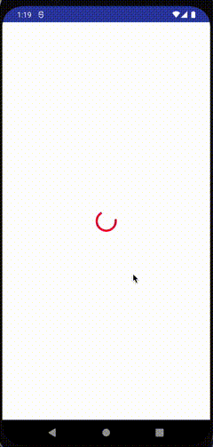
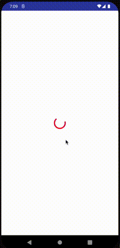
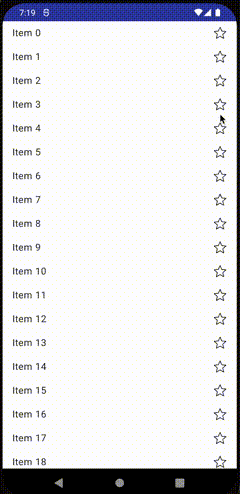

# Exploring the DSL

FlowRedux provides a convenient DSL to describe your state machine.
This page introduces and explains step by step the FlowRedux DSL.

Let's build an example app using FlowRedux:
This app loads a list of items from a web service.
As we introduce more concepts of the DSL we will extend this example with more features.

This page is meant to be read from top to bottom.


## FlowReduxStateMachine
The base class in FlowRedux is `FlowReduxStateMachine`.
It has a very simple public API:

```kotlin
class FlowReduxStateMachine<State, Action> {
    val state : Flow<State>
    suspend fun dispatch(action : Action)
}
```

Every `FlowReduxStateMachine` works on a `State` class.
How you model your state is up to you and depends on what your app and business logic actually has as requirements.
You can collect the `FlowReduxStateMachine.state : Flow<State>` (from Kotlin coroutines library) by calling `.collect()` on it.
Whenever the state of the state machine changes, observers get the updated state via this `Flow`.

We also need a way to "input" something to our state machine like a user has clicked on a button in the UI.
"Inputs" are called `Actions` in FlowRedux.
An example is `data class LoginSubmittedAction(val username : String, val password : String)`.
Again, how you model your Actions is up to you.
There are no constraints or limitations from FlowRedux.
You can dispatch an `Action` with `FlowReduxStateMachine.dispatch(action)`.


That should be enough information to get started with our example app based on FlowRedux.
Let's define the `States`for our state machine.
As said before we load a list of items from a web server (via http) and display that list.
While loading the list we show a loading indicator on the screen and if an error occurs we show an error message on the screen with a retry button.

This gives us the following states:

```kotlin
sealed interface ListState {

    // Shows a loading indicator on screen
    object Loading : ListState

    // List of items loaded successfully, show it on screen
    data class ShowContent(val items: List<Item>) : ListState

    // Error while loading happened
    data class Error(val cause: Throwable) : ListState
}
```

If the state machine reaches the `Error` state then we display an error message in our UI but also a button the users of our app can click to retry loading the items.

This gives us the following `Actions`:

```kotlin
sealed interface Action {
    object RetryLoadingAction : Action
}
```

This is how the UI looks like:



## Initial State

Every `FlowReduxStateMachine` needs an initial state.
This specifies in which state the state machine starts.
In our example we start with the `Loading` state.

```kotlin
class ItemListStateMachine(
    private val httpClient: HttpClient
) : FlowReduxStateMachine<ListState, Action>(initialState = Loading) {

    init {
        spec {
            // will be filled in next section
            ...
        }
    }
}
```

In FlowRedux we need an `init {...}` block containing a `spec { ... }` block inside.
The `spec { ... }` block is actually where we write our state machine specification with the DSL.


## inState`<State>`

The first concept of the DSL we learn is `inState`:

```kotlin
class ItemListStateMachine(
    private val httpClient: HttpClient
) : FlowReduxStateMachine<ListState, Action>(initialState = Loading) {

    init {
        spec {
            inState<Loading> {
                ...
            }
        }
    }
}
```

`inState<Loading>` is just an "entry point".
Next let's discuss what an `inState` block can contain as triggers to actually "do something":

1. `onEnter`: Triggers whenever we enter that state
2. `on<Action>`: Triggers whenever we are in this state and the specified action is triggered from the outside by
   calling `FlowReduxStateMachine.dispatch(action)`.
3. `collectWhileInState( flow )`: You can subscribe to any arbitrary `Flow` while your state machine is in that state.

Additionally `onEnterStartStateMachine()` and `onActionStartStateMachine()` can be placed inside an `inState{ ... }` block, but we will talk about these advanced concepts that are useful for composing business logic later.

Let's take a more closer look at 3 basic elements `onEnter`, `on<Action>` and `collectWhileInState`  as we build our state machine.

## onEnter

What do we want to do when we enter the `Loading`? We want to make the http request to load the items from our server, right?
Let's specify that with the DSL in our state machine:

```kotlin
class ItemListStateMachine(
    private val httpClient: HttpClient
) : FlowReduxStateMachine<ListState, Action>(initialState = Loading) {

    init {
        spec {
            inState<Loading> {
                onEnter { state: State<Loading> ->
                    // we entered the Loading state,
                    // so let's do the http request
                    try {
                        val items = httpClient.loadItems()  // loadItems() is a suspend function
                        state.override { ShowContent(items) }  // return ShowContent from onEnter block
                    } catch (t: Throwable) {
                        state.override { Error(t) }   // return Error state from onEnter block
                    }
                }
            }
        }
    }
}
```

There are a some new things like  `onEnter` and `State<T>`.
We will covered `State<T>` in the next section.

Let's talk about `onEnter`:

- **`onEnter { ... }` is running asynchronously in a coroutine**. That means whatever you do inside the `onEnter` block
  is not blocking anything else. You can totally run here long-running and expensive calls (like doing a http request).
- **`onEnter { ... }` expects a lambda (or function) with the following
  signature: `onEnter( (State<T>) -> ChangedState<T> )`**. We will cover that in detail in the next section.
- **`onEnter { ... }` is executed exactly once when the surrounding `inState<T>` condition is met**.
  It will only executed the next time when the state machine transitions out of the current state and back to it again.
- **The execution of the `onEnter { ... }` is canceled as soon as state condition specified in the surrounding `inState`
doesn't hold anymore** i.e. state has been changes by some other block of the DSL else.
Recall that FlowRedux is a multi-threaded asynchronous state machine. We will talk about that later.

The key takeaway here is that with `onEnter { ... }` you can do some work whenever your state machine is entering this state and then move on to another state by calling `State.override()` or `State.mutate()`

To be able to fully understand the code snipped from above, let's take a look at `State<T>` and `ChangedState<T>`.

## State`<T>` and ChangedState`<T>`
FlowRedux has the concept of a `State<T>` (please note that `T` here is just a placeholder for generics).
It is used as a parameter for many DSL blocks like `onEnter { state : State<MyState> }` etc.
With this `State<T>` object you can get access to the actual state of your statemachine with `State.snapshot`.
Additionally `State<T>` is providing functions to mutate the state or completely override it.
Here is a summary of the API of `State<T>` (simplified version, we will dive deeper in a bit):

```kotlin
class State<T> {
    // This holds the state value of your state machine
    val snapshot : T

    // completely replaces the current state with a new one
    fun override(newState : T) : ChangedState<T>

     // mutates the current state value.
     // This is useful if you want to change just a few properties of your state
     // but not the whole state as .override() does.
    fun mutate(block: T.() -> T ) : ChangedState<T>

    // Special use case for the rare case where you really
    // don't want to change the state.
    fun noChange() : ChangedState<T>
}
```

Please note that `override()` and `mutate()` are just syntactic sugar of the same thing.
The reason why both exist is to clearly hint to other software engineers (i.e. pull request reviews) that you either want to move to an entirely new state or just change a few properties of the current state but overall want to stay in the same type of state.

 - use `override()` to explicitly want to **transition to an entirely new state**
 - use `mutate()` if you want to **change just some properties of the current state but stay in the same state class**.

Examples:
```kotlin
spec {

    // DO USE .override() to clearly say you want to move to another type of state
    inState<Loading>{
        onEnter{ state : State<Loading>  ->
            state.override { Error() }  // OK: move from Loading to Error state
        }
    }

    // DO NOT USE .mutate()
    inState<Loading>{
        onEnter{ state : State<Loading>  ->
            state.mutate { Error() }  // compiler error!
        }
    }
}
```

```kotlin
data class ScreenStatisticsState(
    val name : String,
    val visitCounter : Int
)

spec {
    // DO USE .mutate() to clearly indicate that you just want to
    // change a property but overall stay in same type of state
    inState<ScreenStatisticsState> {
        onEnter { state : State<ScreenStatisticsState> ->
            state.mutate { this.copy(visitCounter= this.visitCounter + 1) } // OK: just update a property but stay in ScreenStatisticsState
        }
    }

    // DO NOT USE .override() as you don't want to move to another type of state
    inState<ScreenStatisticsState> {
        onEnter { state : State<ScreenStatisticsState> ->
            state.override {
                this.copy(visitCounter= this.visitCounter + 1) // compiles but hard to read
            }
        }
    }
}
```


As you see from a `State<T>` you can produce a `ChangedState`.
`ChangedState` is something that simply tells FlowRedux internally how the reducer of the FlowReduxStateMachine should merge and compute the next state of your statemachine.
`ChangedState` is not meant to be used or instantiated by you manually.
You may wonder "what about writing unit tests?".
We will cover testing and best practices in a [dedicated section](/testing).

We will dive deeper on `State.override()` and `State.mutate()` as we continue with our `ItemListStateMachine` example.

## on`<Action>`

How do we deal with external user input like clicks in FlowRedux?
This is what `Action` is for.
With the DSL of FlowRedux you can specify what should be done when a certain `Action` (triggered by the user) happened.

In our example we want to retry loading if we are in `Error` state. In the `Error` state our UI shows a error text and a button the user can click on to retry loading the list of items.
Clicking on that button dispatches a `RetryLoadingAction` to our state machine.
Let's extend our `ItemListStateMachine` to react on such an action:

```kotlin
class ItemListStateMachine(
    private val httpClient: HttpClient
) : FlowReduxStateMachine<ListState, Action>(initialState = Loading) {

    init {
        spec {
            inState<Loading> {
                onEnter { state: State<Loading> ->
                    // We have discussed this block already in a previous section
                    try {
                        val items = httpClient.loadItems()
                        state.override { ShowContent(items) }
                    } catch (t: Throwable) {
                        state.override { Error(t) }
                    }
                }
            }

            // let's add a new inState{...} with an on{...} block
            inState<Error> {
                on<RetryLoadingAction> { action: RetryLoadingAction, state: State<Error> ->
                    // This block triggers if we are in Error state and
                    // RetryLoadingAction has been dispatched to this state machine.
                    // In that case we transition to Loading state which then starts the http
                    // request to load items again as the inState<Loading> + onEnter { ... } triggers

                    state.override { Loading }
                }
            }
        }
    }
}
```

A `on { ... }` block gets 2 parameters:  `action` which is the actual instance of the `Action` that triggered this block
and `state : State<T>` which gives us access to the current state and let us to state transitions with `.override()`.
`on { ... }` is actually pretty similar to `onEnter {...}` just with a different "trigger" (action vs. entering a state)
. Furthermore, `on { ... }` has the same characteristics as `onEnter { ... }`:

- **`on { ... }` is running asynchronously in a coroutine**. That means whatever you do inside the `on` block is not
  blocking anything else. You can totally run here long-running and expensive calls (like doing a http request).
- **`on { ... }` expects a lambda (or function) with the following
  signature: `(action : Action , state : State<T>) -> ChangedState<T>`**.
- **The execution of the `on { ... }` is canceled as soon as state condition specified in the surrounding `inState` block
  doesn't hold anymore (i.e. state has been changes by something else).**

So far this is how our result look like:


## collectWhileInState()

This one is useful if you want to collect a `Flow` (from Kotlin Coroutines) only while being exactly in that state.
To give a concrete example how this is useful let's extend our `ItemListStateMachine` example.
Let's say whenever our state machine is in `Error` state we want
to retry loading the items after 3 seconds in `Error` state or anytime before the 3 seconds have elapsed if the user clicks the retry button.
Furthermore the 3 seconds countdown timer should be displayed in our UI as well.
This is how the UI should look like:



To implement this let's first extend our `Error` state:

```kotlin
data class Error(
    val cause: Throwable,
    val countdown: Int // This value is decreased from 3 then 2 then 1 and represents the countdown value.
) : ListState
```

Now let's add some countdown capabilities to our state machine by using `collectWhileInState()`:

```kotlin
class ItemListStateMachine(
    private val httpClient: HttpClient
) : FlowReduxStateMachine<ListState, Action>(initialState = Loading) {

    init {
        spec {
            inState<Loading> {
                onEnter { state: State<Loading> ->
                    // We have discussed this block already in a previous section
                    try {
                        val items = httpClient.loadItems()
                        state.override { ShowContent(items) }
                    } catch (t: Throwable) {
                        state.override { Error(t, countdown = 3) }   // countdown is new
                    }
                }
            }

            inState<Error> {
                on<RetryLoadingAction> { action: RetryLoadingAction, state: State<Error> ->
                    // We have discussed this block already in a previous section
                    state.override { Loading }
                }

                val timer : Flow<Int> = timerThatEmitsEverySecond()
                collectWhileInState(timer) { timerValue: Int, state: State<Error> ->
                    // This block triggers every time the timer emits
                    // which happens every second
                    state.override { // we use .override() because we could move to another type of state
                        // inside this block, this references Error state
                        if (this.countdown > 0)
                            this.copy(countdown = this.countdown - 1) // decrease countdown by 1 second
                        else
                            Loading // transition to the Loading state
                    }
                }
            }
        }
    }

    private fun timerThatEmitsEverySecond(): Flow<Int> = flow {
        var timeElapsed = 0
        while (isActive) {  // is Flow still active?
            delay(1_000)     // wait 1 second
            timeElapsed++
            emit(timeElapsed) // Flow Emits value
        }
    }
}
```

Let's look at the source code above step by step.
What is new is that `Error` state contains now an additional
field  `countdown : Int` which we set on transitioning from `Loading` to `Error(countdown = 3)` (means 3 seconds left on the countdown clock).

We extend ` inState<Error> { ... }` block and add `collectWhileInState(timer)` block.
`timer` is a `Flow<Int>` that emits a new (incremented) number every second.
`collectWhileInState(timer)` internally calls `.collect {...}` on the flow passed as first parameter (in our case the `timer`).
The second parameter is the a  block with the parameters `timerValue : Int` and `State<Error>`.

In other words: instead of calling `timer.collect { ... }` directly you
call `collectWhileInState(timer) { ... }` to collect the Flow.
FlowRedux then takes care of canceling the flow once the surrounding `inState{ ... }` condition doesn't hold anymore. In our case, the timer is automatically canceled once the state machine transitions from
`Error` state into another state.
This happens either when the user clicks on the retry button and which
triggers `on<RetryLoadingAction>` which causes a state transition to `Loading` or when 3 seconds have elapsed (inside `collectWhileInState(timer)`).

## Effects
If you don't want to change the state but do some work without changing the state i.e. logging,
triggering google analytics or trigger navigation then Effects are what you are looking for.

The following counterparts to `on<Action>`, `onEnter` and `collectWhileInState` exists:

- `onActionEffect<Action>`: Like `on<Action>` this triggers whenever the described Action is dispatched.
- `onEnterEffect`: Like `onEnter` this triggers whenever you enter the state.
- `collectWhileInStateEffect`: Like `collectWhileInState` this is used to collect a `Flow`.


Effects behave the same way as their counterparts.
For example cancelation etc. works just the same way as described in the section of `on<Action>`, `onEnter` and `collectWhileInState`.Effects

Usage:
```kotlin
class ItemListStateMachine : FlowReduxStateMachine<ListState, Action>(initialState = Loading) {

    init {
        spec {
            inState<Error> {
               onEnterEffect { stateSnapshot : Error ->
                   logMessage("Did enter $stateSnapshot") // note there is no state change
               }

               onActionEffect<RetryLoadingAction> { action : RetryLoadingAction, stateSnapshot : Error ->
                    analyticsTracker.track(ButtonClickedEvent()) // note there is no state change
               }

                val someFolow : Flow<String> = ...
                collectWhileInStateEffect(someFlow) {value : String , stateSnapshot : Error ->
                    logMessage("Collected $value from flow while in state $stateSnapshot") // note there is no state change
                }
            }

        }
    }
}
```

## Custom condition for inState

We already covered `inState<State>` that builds upon the recommended best practice that every State of your state machine is expressed us it's own type in Kotlin.

Sometimes, however, you need a bit more flexibility than just relaying on types to model state.
For that use case you can use `inStateWithCondition(isInState: (State) -> Boolean)`.

Example: One could have also modeled the state for our `ItemListStateMachine` as the following:

```kotlin
// TO MODEL YOUR STATE LIKE THIS IS NOT BEST PRACTICE!
// In a real world example we recommend using sealed class instead.
data class ListState(
    val loading: Boolean, // true means loading, false means not loading
    val items: List<Items>, // empty list if no items loaded yet
    val error: Throwable?, // if not null we are in error state
    val errorCountDown: Int? // the seconds for the error countdown
)
```

**AGAIN, the example shown above is not the recommended way.
We strongly recommend to use sealed classes instead to model state as shown at the beginning of this document.**

We just do this for demo purpose to demonstrate a way how to customize `inState`.
Given the state from above, what we  can do now with our DSL is the following:

```kotlin
class ItemListStateMachine(
    private val httpClient: HttpClient
) : FlowReduxStateMachine<ListState, Action>(
    initialState = State(
        loading = true,
        items = emptyList(),
        error = null,
        errorCountDown = null
    )
) {

    init {
        spec {
            inStateWithCondition(isInState = { state -> state.loading == true }) {
                onEnter { state: State<ListState> ->
                    // we entered the Loading, so let's do the http request
                    try {
                        val items = httpClient.loadItems()
                        state.mutate {
                            this.copy(loading = false, items = items, error = null, errorCountdown = null)
                        }
                    } catch (t: Throwable) {
                        state.mutate {
                            this.copy(loading = false, items = emptyList(), error = t, errorCountdown = 3)
                        }
                    }
                }
            }

            inStateWithCondition(isInState = { state -> state.error != null }) {
                on<RetryLoadingAction> { action : RetryLoadingAction, state : State<ListState> ->
                    state.mutate {
                        this.copy(loading = true, items = emptyList(), error = null, errorCountdown = null)
                    }
                }

                val timer : Flow<Int> = timerThatEmitsEverySecond()
                collectWhileInState(timer) { value : Int, state : State<ListState> ->
                    state.mutate {
                        if (errorCountdown!! > 0)
                            //  decrease the countdown by 1 second
                            this.copy(errorCountdown = this.errorCountdown!! - 1)
                        else
                            // transition to the Loading
                            this.copy(
                                loading = true,
                                items = emptyList(),
                                error = null,
                                errorCountdown = null
                            )
                    }
                }
            }
        }
    }
}
```

Instead of `inState<State> { ... }` use `inStateWithCondition`  .
It takes a lambda as parameter that looks like `(State) -> Boolean` so that.
If that lambda returns `true` it means we are in that state, otherwise not (returning false).
The rest still remains the same.
You can use `onEnter`, `on<Action>` and `collectWhileInState` the exact way as you already know.
However, since `inStateWithCondition` has no generics, FlowRedux cannot infer types in `onEnter`, `on`, etc.

## Acting across multiple states

If for whatever reason you want to trigger a state change for all states you can achieve that by
using `inState<>` on a base class.

```kotlin
// DSL specs
spec {
    inState<ListState> {
        // on, onEnter, collectWhileInState for all states because
        // ListState is the base class, thus these never get cancelled
    }

    inState<Loading> {
        // on, onEnter, collectWhileInState specific to Loading state
    }

    inState<ShowContent> {
        // on, onEnter, collectWhileInState specific to ShowContent state
    }

    ...
}
```

In case you want to trigger state changes from a subset of states you could introduce another
level to your state class hierarchy. For example the following would allow you to have a
`inState<PostLoading>` block to share actions between `ShowContent` and `Error`:

```kotlin
sealed interface ListState {

    // Shows a loading indicator on screen
    object Loading : ListState

    sealed interface PostLoading : ListState

    // List of items loaded successfully, show it on screen
    data class ShowContent(val items: List<Item>) : PostLoading

    // Error while loading happened
    data class Error(val cause: Throwable) : PostLoading
}
```


## ExecutionPolicy

Have you ever wondered what would happen if you would execute `Action` very fast 1 after another?
For example:

```kotlin
spec {
    inState<FooState> {
        on<BarAction> { action, state : State<FooState> ->
            delay(5000) // wait for 5 seconds
            state.override { OtherState() }
        }
    }
}
```

The example above shows a problem with async. state machines like FlowRedux:
If our state machine is in `FooState` and a `BarAction` got triggered, we wait for 5 seconds and then set the state to another state.
What if while waiting 5 seconds (i.e. let's say after 3 seconds of waiting) another `BarAction` gets
triggered.
That is possible, right?
With `ExecutionPolicy` you can specify what should happen in that case.
There are three options to choose from:

- `CANCEL_PREVIOUS`: **This is the default one automatically applied unless specified otherwise.** It would cancel any previous execution and just run the latest one. In the example mentioned it means the previous still running `BarAction` handler gets canceled and a new one with the laster `BarAction` starts.
- `UNORDERED`: Choosing this causes all the blocks to continue running but there are no guarantees in which order. For example:

    ```kotlin
    spec {
        inState<FooState> {
            on<BarAction>(executionPolicy = FlapMapPolicy.UNORDERED) { _, state : State<FooState> ->
                delay(randomInt()) // wait for some random time
                state.override { OtherState }
            }
        }
    }
    ```

    Let's assume that we trigger two times `BarAction`.
    We use random amount of seconds for waiting.
    Since we use `UNORDERED` as policy `on<BarAction>` the handler block gets executed 2 times without canceling the previous one (that is the difference  to `CANCEL_PREVIOUS`).
    Moreover, `UNORDERED` doesn't make any promise on order of execution of the block (see `ORDERED` if you need promises on order).
    If `on<BarAction>` gets executed two times it will run in parallel and the the second execution
    could complete before the first execution (because using a random time of waiting).

- `ORDERED`: In contrast to `UNORDERED` and `CANCEL_PREVIOUS`, `ORDERED` will not run `on<BarAction>` in parallel and will not cancel any previous execution. Instead, `ORDERED` will preserve the order.

`on<Action>` and `collectWhileInstate()` can specify an `ExecutionPolicy`:

- `on<Action>(executionPolicy = ExecutionPolicy.CANCEL_PREVIOUS) { ... }`
- `collectWhileInState(executionPolicy = ExecutionPolicy.CANCEL_PREVIOUS) { ... }`

Please note that `onEnter` doesn't have the option to specify `ExecutionPolicy`.

## Best practice: make your DSL spec readable

One very important aspect of the DSL is to provide a readable and maintainable way to reason about your state machine.
Let' take a look at our example state machine:

```kotlin
class ItemListStateMachine(
    private val httpClient: HttpClient
) : FlowReduxStateMachine<ListState, Action>(initialState = Loading) {

    init {
        spec {
            inState<Loading> {
                onEnter { state: State<Loading> ->
                    // We have discussed this block already in a previous section
                    try {
                        val items = httpClient.loadItems()
                        state.override { ShowContent(items) }
                    } catch (t: Throwable) {
                        state.override { Error(t, countdown = 3) }   // countdown is new
                    }
                }
            }

            inState<Error> {
                on<RetryLoadingAction> { action: RetryLoadingAction, state: State<Error> ->
                    // We have discussed this block already in a previous section
                    state.override { Loading }
                }

                val timer : Flow<Int> = timerThatEmitsEverySecond()
                collectWhileInState(timer) { timerValue: Int, state: State<Error> ->
                    // This block triggers every time the timer emits
                    // which happens every second
                    state.override { // we use .override() because we could move to another type of state
                        // inside this block, this references Error state
                        if (this.countdown > 0)
                            this.copy(countdown = this.countdown - 1) // decrease countdown by 1 second
                        else
                            Loading // transition to the Loading state
                    }
                }
            }
        }
    }

    private fun timerThatEmitsEverySecond(): Flow<Int> = flow {
        var timeElapsed = 0
        while (isActive) {  // is Flow still active?
            delay(1000)     // wait 1 second
            timeElapsed++
            emit(timeElapsed) // Flow Emits value
        }
    }
}
```

Do you notice something?
With more blocks we add the state machine itself gets harder to read, understand and maintain.
What we are aiming for with FlowRedux and it's DSL is to get a readable overview about what the state machine is supposed to do on a high level.
If you take a look at the example from above, however, you will notice that it isn't easy
to read and get bloated with implementation details.

## Extract logic to functions

We recommend keeping the DSL `spec { ... }` block really short, expressive, readable and maintainable.
Therefore, instead of having implementation details in your DSL we recommend to extract that to functions instead.
Let's refactor the example above to reflect this idea:

```kotlin
class ItemListStateMachine(
    private val httpClient: HttpClient
) : FlowReduxStateMachine<ListState, Action>(initialState = Loading) {

    // This is the specification of your state machine.
    // Less implementation details, better readability.
    init {
        spec {
            inState<Loading> {
                onEnter { loadItemsAndMoveToContentOrError(it) }
            }

            inState<Error> {
                on<RetryLoadingAction> { action, state ->
                    // For a single line statement it's ok to keep logic inside the block instead
                    // of extracting it a function (but it also depends on your testing strategy)
                    state.override { Loading }
                }

                collectWhileInState(timerThatEmitsEverySecond()) { value, state  ->
                    decrementCountdownAndMoveToLoading(value, state)
                }
            }
        }
    }


    //
    // All the implementation details are in the functions below.
    //
    private suspend fun loadItemsAndMoveToContentOrError(state: State<Loading>): ChangedState<State> {
        return try {
            val items = httpClient.loadItems()
            state.override { ShowContent(items) }
        } catch (t: Throwable) {
            state.override { Error(cause = t, countdown = 3) }
        }
    }

    private fun decrementCountdownAndMoveToLoading(
        value: Int,
        state: State<Error>
    ): ChangedState<State> {
        return state.override {
            if (this.countdownTimeLeft > 0)
                this.copy(countdown = countdownTimeLeft - 1)
            else
                Loading
        }
    }

    private fun timerThatEmitsEverySecond(): Flow<Int> = flow {
        var timeElapsed = 0
        while (isActive) {
            delay(1000)
            timeElapsed++
            emit(timeElapsed)
        }
    }
}
```

Moreover, have you notice that the extracted function now all get a similar method signature:

```kotlin
suspend fun doSomething(state : State<T>) : ChangedState<T>
```

We are now getting closer to [pure functions](https://en.wikipedia.org/wiki/Pure_function).
This makes writing unit test easier because for the same input (`State`) pure functions return the same output (`ChangedState`).
We will talk about that more in detail in the dedicated section about testing best practices.


## Composing state machines (hierarchical state machines)
With FlowRedux you can compose state machines from other state machines.
This concept is called hierarchical state machines.
In this section we will introduce `onActionStartStateMachine()` and `onEnterStartStateMachine()`.

Think about [Jetpack Compose](https://developer.android.com/jetpack/compose), [SwiftUI](https://developer.apple.com/xcode/swiftui/) or [React](https://reactjs.org/).
They are declarative frameworks to build UI.
Furthermore, you are encourage by these frameworks to build reusable UI components.
Wouldn't it be great to get the same for your business logic?
With FlowRedux's `onActionStartStateMachine()` and `onEnterStartStateMachine()` you can do that.

Advantages:
- reuse state machines while still keep them decoupled and encapsulated from each other
- favor composition over inheritance
- easier to test

### `onActionStartStateMachine()`
Let's continue enhancing our `ItemListStateMachine`.
`ShowContent` state is defined as following:

```kotlin
data class ShowContent(val items: List<Item>) : ListState

data class Item(val id : Int, val name : String)
```

Let's say we want to have the option to mark an `Item` as favorite (and also remove an Item as favorite).
The favorite items are actually saved on a server and we communicate with it over http.
Let's extend `Item` class to model this new requirements:

```kotlin
data class Item(
    val id : Int,
    val name : String,
    val favoriteStatus : FavoriteStatus
)

sealed interface FavoriteStatus {
    val itemId : Int

    // It is not marked as favorite yet
    data class NotFavorite(override val itemId : Int) : FavoriteStatus

    // Marked as favorites
    data class Favorite(override val itemId : Int) : FavoriteStatus

    // An operation (read: http request) is in progress to either mark
    // it as favorite or not mark it as favorite
    data class OperationInProgress(
        override val itemId : Int,
        val markAsFavorite : Boolean // true means mark as favorite, false means unmark it
    ) : FavoriteStatus

    // The operation (read: http request) to either mark it as favorite
    // or unmark it as favorite has failed; so did not succeed.
    data class OperationFailed(
        override val itemId : Int,
        val markAsFavorite : Boolean // true means mark as favorite, false means unmark it
    ) : FavoriteStatus
}
```

You may wonder why we need `FavoriteStatus` and why it is not just a `Boolean` to reflect marked as favorite or not?
Remember: we also need to talk to a server (via http) whenever the user wants to mark an `Item` as favorite or unmark it.
The UI looks like this:


Let's for now ignore the `ItemListStateMachine` and only focus on our new requirements: marking an `Item` as favorite (or unmark it) plus the communication with our backend server to store that information.
We could add this new requirements with  our DSL to `ItemListStateMachine` somehow or we extract that into a small stand alone state machine.
Let's call this state machine `FavoriteStatusStateMachine` and use the FlowRedux DSL to define it's logic.
Additionally, let's say when an network error in the communication with the backend server happened we will show an error for 3 seconds and then reset back to either maked as favorite or not.

```kotlin
class FavoriteStatusStateMachine(
    item : Item,
    private val httpClient : HttpClient
) : FlowReduxStateMachine<FavoriteStatus, Nothing>( // doesn't handle Action, thus we can use Nothing
    initialState = OperationInProgress(
        itemId = item.itemId,
        markAsFavorite = item.favoriteStatus is NotFavorite
    )
) {
    init {
        spec {
            inState<OperationInProgress>{ 
                onEnter { state ->
                    toggleFavoriteAndSaveToServer(state)
                }
            }

            inState<OperationFailed>{
                onEnter{ state ->
                    waitFor3SecondsThenResetToOriginalState(state)
                }
            }
        }
    }

    private suspend fun toggleFavoriteAndSaveToServer(
        state : State<OperationInProgress>
    ) : ChangedState<FavoriteStatus>{
        return try {
            val itemId = state.snapshot.itemId
            val markAsFavorite = state.snapshot.markAsFavorite

            httpClient.toggleFavorite(
                itemId = itemId,
                markAsFavorite = markAsFavorite // if false then unmark it, if true mark it as favorite
            )

            if (markAsFavorite)
                state.override { Favorite(itemId) }
            else
                state.override { NotFavorite(itemId) }

        } catch(exception : Throwable){
            state.override { OperationFailed(itemId, markAsFavorite) }
        }
    }

    private suspend fun waitFor3SecondsThenResetToOriginalState(
        state : State<OperationFailed>
    ) : ChangedState<FavoriteStatus> {
        delay(3_000) // wait for 3 seconds
        val itemId = state.snapshot.itemId
        val markAsFavorite = state.snapshot.markAsFavorite
        return if (markAsFavorite)
                    // marking as favorite failed,
                    // thus original status was "not marked as favorite"
                    state.override { NotFavorite(itemId) }
                else
                    state.override { Favorite(itemId) }
    }
}
```

All that `FavoriteStatusStateMachine` does is making an http request to the backend and in case of error reset back to the previous state after showing an error state for 3 seconds.

This is how the UI should looks like:




Now let's connect this with our `ItemListStateMachine` by using `onActionStartStateMachine()`.

```kotlin
data class ToggleFavoriteItemAction(val itemId : Int) : Action

class ItemListStateMachine(
    private val httpClient: HttpClient
) : FlowReduxStateMachine<ListState, Action>(initialState = Loading) {

    // This is the specification of your state machine.
    // Less implementation details, better readability.
    init {
        spec {
            inState<Loading> {
                onEnter { loadItemsAndMoveToContentOrError(it) }
            }

            inState<Error> {
                on<RetryLoadingAction> { action, state ->
                   state.override { Loading }
                }

                collectWhileInState(timerThatEmitsEverySecond()) { value, state  ->
                    decrementCountdownAndMoveToLoading(value, state)
                }
            }

            // NEW DSL block
            inState<ShowContent> {

                // on ToggleFavoriteItemAction start statemachine
                onActionStartStateMachine(
                    stateMachineFactory = {
                        action: ToggleFavoriteItemAction, stateSnapshot : ShowContent ->
                        val item : Item = stateSnapshot.items.find { it == action.itemId}
                        // create and return a new FavoriteStatusStateMachine instance
                        FavoriteStatusStateMachine(item, httpClient)
                    },

                    stateMapper = {
                        itemListState : State<ShowContent>, favoriteStatus :FavoriteStatus ->

                        itemListState.mutate {
                            val itemToRepace : Item = this.items.find { it == favoriteStatus.itemId }
                            val updatedItem : Item = itemToReplace.copy(favoriteStatus = favoriteStatus)

                            // Create a copy of ShowContent state with the updated item
                            this.copy(items = this.items.copyAndReplace(itemToReplace, updatedItem) )
                        }
                    }
                )
            }
        }
    }

    ...
}
```

First, let's take a look at `onActionStartStateMachine()` public API.
It has 3 parameters.
Multiple overloads exists, and in our case the one with only 2 parameters is enough.
Nevertheless, let's explain all 3 parameters of `onActionStartStateMachine()`:

1. `stateMachineFactory: (Action, State) -> FlowReduxStateMachine`: Inside this block you create a state machine. In our case we create a `FavoriteStatusStateMachine`. You have access to the current state of the `ItemListStateMachine` and the `Action` that has triggered `onActionStartStateMachine()`
2. `stateMapper: (State<T>, StateOfNewStateMachine) -> ChangedState<T>`: we need to have a way to combine the state of the newly started state machine with the one of the "current" state machine. In our case we need to combine `ItemListStateMachine`'s state with  `FavoriteStatusStateMachine`'s state. That is exactly what `stateMapper` is good for. The difference is that `ItemListStateMachine` provides a `State<T>` to the `stateMapper` (first parameter) whereas `FavoriteStatusStateMachine` provides the current `FavoriteState` (not `State<FavoriteState>`). The reason is that at the end we need to get a compatible state for `ItemListStateMachine` and that is what we need to do through the already known `State<T>.override()` or `State<T>.mutate()` methods.
3. `actionMapper: (Action) -> OtherStateMachineAction?`: We didn't need this in our example above because `FavoriteStatusStateMachine` is not dealing with any Action. In theory, however, we need to "forward" actions from `ItemListStateMachine` to  `FavoriteStatusStateMachine`. But since the actions of the 2 state machines could be of different types, we would need to map an action type of `ItemListStateMachine` to another action type of `FavoriteStatusStateMachine` or `null` if not all actions are supposed to be handled by `FavoriteStatusStateMachine`. Returning `null` in the `actionMapper` means the action is not forwarded to `FavoriteStatusStateMachine`.  Again, this is not needed here in this example, but in theory could be needed in other use cases.

You may wonder what the lifecycle of the state machine started from `onActionStartStateMachine()` looks like:
- the state machine start (in our case `FavoriteStatusStateMachine`) will be kept as long alive as the surrounding `inState<State>` holds true. This works just like the other DSL primitives work (like `on<Action>`). In our example a `FavoriteStatusStateMachine` is canceled when `ItemListStateMachine` transitions away from `ShowContent` state.
- Every time an `Action` that is handled by `onActionStartStateMachine()` is dispatched, then the `stateMachineFactory` is invoked and a new state machine gets started. Important is that actions are distinguished by it's `.equals()` method. In our example `ToggleFavoriteItemAction(itemId = 1)` and `ToggleFavoriteItemAction(itemId = 2)` are two different Action because `ToggleFavoriteItemAction.equals()` also takes `itemId` into account. Therefore, with 2 instances of `FavoriteStatusStateMachine` are started, one for itemId = 1 and one for itemId = 2.
-  if the `.equals()` same `ToggleFavoriteItemAction(itemId = 1)` gets dispatched, then the previous started state machine gets canceled and a new one starts (with the latest `action` as trigger). There is always only 1 state machine for the same `action` as trigger running.


### Make DSL even more readable with custom DSL additions
In the previous section we have introduced `onActionStartStateMachine()` but it is quite a bit of code in our otherwise nicely readable `spec { }` block:

```kotlin
spec {
    inState<Loading> {
        onEnter { loadItemsAndMoveToContentOrError(it) }
    }

    inState<Error> {
        on<RetryLoadingAction> { action, state ->
            state.override { Loading }
        }

        collectWhileInState(timerThatEmitsEverySecond()) { value, state  ->
            decrementCountdownAndMoveToLoading(value, state)
        }
    }

    inState<ShowContent> {

        // Quite a bit of unreadable code
        onActionStartStateMachine(
            stateMachineFactory = {
                action: ToggleFavoriteItemAction, stateSnapshot : ShowContent ->
                val item : Item = stateSnapshot.items.find { it == action.itemId}
                // create and return a new FavoriteStatusStateMachine instance
                FavoriteStatusStateMachine(item, httpClient)
            },

            stateMapper = {
                itemListState : State<ShowContent>, favoriteStatus :FavoriteStatus ->

                itemListState.mutate {
                    val itemToReplace : Item = this.items.find { it == favoriteStatus.itemId }
                    val updatedItem : Item = itemToReplace.copy(favoriteStatus = favoriteStatus)

                    // Create a copy of ShowContent state with the updated item
                    this.copy(items = this.items.copyAndReplace(itemToReplace, updatedItem) )
                }
            }
        )
    }
}
```

We can do better than this, right?
How?
Which Kotlin extension functions and receivers.
The receiver type is `InStateBuilderBlock` is what `inState<S>` is operating in.

```kotlin
spec {
    inState<Loading> {
        onEnter { loadItemsAndMoveToContentOrError(it) }
    }

    inState<Error> {
        on<RetryLoadingAction> { action, state ->
            state.override { Loading }
        }

        collectWhileInState(timerThatEmitsEverySecond()) { value, state  ->
            decrementCountdownAndMoveToLoading(value, state)
        }
    }

    inState<ShowContent> {
        onToggleFavoriteActionStartStateToggleFavoriteStateMachine()
    }
}


private fun InStateBuilderBlock.onToggleFavoriteActionStartStateToggleFavoriteStateMachine(){
    onActionStartStateMachine(
        stateMachineFactory = {
            action: ToggleFavoriteItemAction, stateSnapshot : ShowContent ->
            val item : Item = stateSnapshot.items.find { it == action.itemId}
            // create and return a new FavoriteStatusStateMachine instance
            FavoriteStatusStateMachine(item, httpClient)
        },

        stateMapper = {
            itemListState : State<ShowContent>, favoriteStatus :FavoriteStatus ->

            itemListState.mutate {
                val itemToReplace : Item = this.items.find { it == favoriteStatus.itemId }
                val updatedItem : Item = itemToReplace.copy(favoriteStatus = favoriteStatus)

                // Create a copy of ShowContent state with the updated item
                this.copy(items = this.items.copyAndReplace(itemToReplace, updatedItem) )
            }
        }
    )
}
```

### onEnterStartStateMachine()

Similar to `onActionStartStateMachine()` FlowRedux provides a primitive to start a state machine `onEnter{ ... }`

The syntax looks quite similar to `onActionStartStateMachine()`:

```kotlin
spec {

    inState<MyState>{
        onEnterStartStateMachine(
            stateMachineFactory = { stateSnapshot : MyState  -> SomeFlowReduxStateMachine() },
            stateMapper = { state : State<MyState>, someOtherStateMachineState : S ->
                state.override { ... }
            }
        )
    }
}
```


## Testing
You may wonder what is the best way to test a `FlowReduxStateMachine`?
There are two strategies we want to discuss here in this section:

1. functional integration tests: test the whole state machine as a whole.
2. Unit tests to test only a certain handler such as `onEnter {}`, `on<Action>` and so on.


### Functional integration tests with Turbine
This is our recommended way for testing `FlowReduxStateMachine`.
For this we need [Turbine](https://github.com/cashapp/turbine).
Turbine is a library that makes testing `Flow` from Kotlin coroutine much easier.

Let's say we want to test our `ItemListStateMachine`.
With turbine we can do that step by ste quite easily:

```kotlin
import kotlinx.coroutines.test.runTest

@Test
fun `state machine starts with Loading state`() = runTest {
    val statemachine = ItemListStateMachine(HttpClient())
    statemachine.state.test {
        // awaitItem() from Turbine waits until next state is emitted.
        // FlowReduxStateMachine emits initial state immediately.
        assertEquals(Loading, awaitItem())
    }
}

@Test
fun `move from Loading to ShowContent state on successful http response`() = runTest {
    val items : List<Item> =  generatesomeFakeItems()
    val httpClient = FakeHttpClient(successresponse = items)
    val statemachine = ItemListStateMachine(httpClient)
    statemachine.state.test {
        assertEquals(Loading, awaitItem()) // initial state
        assertEquals(ShowContent(items), awaitItem()) // loading successful --> ShowContent state
    }
}

@Test
fun `move from Loading to Error state on error http response`() = runTest {
    val exception = IOExpcetion("fake exception")
    val httpClient = FakeHttpClient(error = exception)
    val statemachine = ItemListStateMachine(httpClient)
    statemachine.state.test {
        assertEquals(Loading, awaitItem()) // initial state
        assertEquals(Error(cause = exception, countdown = 3), awaitItem())
    }
}
```

We can apply this pattern all the time, but isn't it a bit annoying to always start our state machine from initial state and have to go thorough all the state transitions until we reach the state we want to test?
Well, one nice side effect of using state machines is that you can jump to a certain state right from the beginning.
To be able to do that we need to pass the initial  state as constructor parameter like this:

```kotlin
class ItemListStateMachine(
    private val httpClient: HttpClient,
    initialState : ListState = Loading // now constructor parameter
) : <ListState, Action>(initialState) { ... }
```

Now let's write a test that checks that pressing the retry button works:

```kotlin
@Test
fun `from Error state to Loading if RetryLoadingAction is dispatched`() = runTest {
    val initialState = Error(cause = IOException("fake"), countdown = 3)
    val statemachine = ItemListStateMachine(httpClient, initialState)

    statemachine.state.test {
        assertEquals(initialState, awaitItem())
        // now we dispatch the retry action
        statemachine.dispatch(RetryLoadingAction)

        // next state should then be Loading
        assertEquals(Loading, awaitItem())
    }
}

@Test `once Error countdown is 0 move to Loading state`() = runTest {
    val cause = IOException("fake")
    val initialState = Error(cause = cause, countdown = 3)
    val statemachine = ItemListStateMachine(httpClient, initialState)

    statemachine.state.test {
        assertEquals(initialState, awaitItem())
        assertEquals(Error(cause, 2))
        assertEquals(Error(cause, 1))
        assertEquals(Error(cause, 0))
        assertEquals(Loading, awaitItem())
    }
}
```

### Unit testing handlers
Another way how you can test your state machines is on unit test level, but it requires that you logic is extracted into functions.

For example, let's say we want to unit test `loadItemsAndMoveToContentOrError()`

```kotlin
spec {
    inState<Loading> {
        onEnter { loadItemsAndMoveToContentOrError(it) }
    }
}

suspend fun loadItemsAndMoveToContentOrError(state: State<Loading>): ChangedState<State> {
    return try {
        val items = httpClient.loadItems()
        state.override { ShowContent(items) }
    } catch (t: Throwable) {
        state.override { Error(cause = t, countdown = 3) }
    }
}
```

We can do that as such:

```kotlin
@Test
fun `on http success move to ShowContent state`() = runTest{
    val items : List<Item> =  generatesomeFakeItems()
    val httpClient = FakeHttpClient(successresponse = items)
    val statemachine = ItemListStateMachine(httpclient)

    val startState = State(Loading) // Create a FlowRedux State object
    val changedState : ChangedState<ListState> = statemachine.loadItemsAndMoveToContentOrError(startState)

    val result : ListState = changedState.reduce(startState.snapshot) // FlowRedux API: you must call reduce

    val expected = ShowContent(items)
    assertEquals(expected, result)
}
```

With FlowRedux you can write unit tests, but there is a bit of overhead:

1. You need to wrap the actual state into FlowRedux `State` class.
2. To get from a `ChangedState` to the actual value you need to call `.reduce()` on it.

What we basically have to do here is what FlowRedux does internally.
In the future we may provide a more convenient way to write this kind of unit tests with less overhead.
