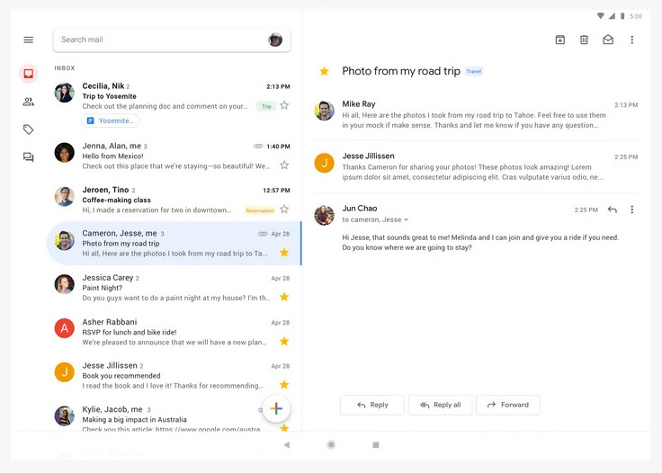

# untilIdentityChanged

In addition to specify that a certain condition must be met (like you can with `inState` or `condition()`), 
you can express with `untilIdentityChanged` that a following block is active until a certain property of a state has changed. 
Let's take a look at a concrete example to understand `untilIdentityChanged` better.

Let's say your app has a "master-detail" UI.
Think of something like an email client that has on the left a list of all emails where you can select an email from to then see the full email body on the right of the screen:



```kotlin
data class InboxState(
    val emails : List<Email>
    val selectedEmail : SelectedEmail?
)

data class SelectedEmail(
    val emailId : Int, 
    val details : EmailDetails?
)
```

```
spec {
    inState<InboxState> {
        onEnter { loadEmails() }
        on<EmailSelected> { action, state -> state.mutate {
            copy(selectedEmail = SelectedEmail(
                    emailId = action.selectedEmail.id,
                    details = null
                ))
            } 
        }

        untilIdentityChanged({ state -> state.selectedEmail?.emailId }) {
            // this block will be canceled and restarted whenever emailId changes
            onEnter { state -> 
                val s = state.snapshot
                if (s.selectedEmail != null) {
                    val details = loadEmailDetails(state.selectedEmail.emailId)
                    state.mutate { 
                        copy(selectedEmail = selectedEmail.details = details)
                    }
                } else {
                    state.noChange()
                }
            }
        }
    }
}
```

What 